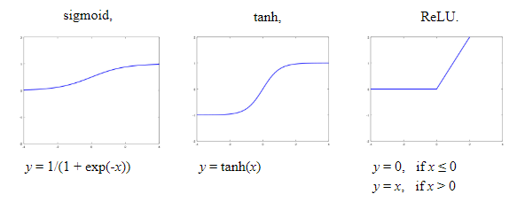
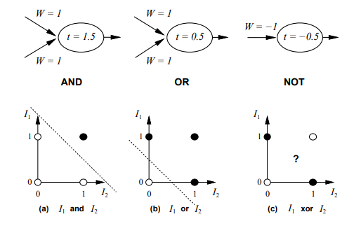

# Perceptrons
## Neural Networks Introduction
* Input edges with weights
* Output edges with weights
* Weights change over time
* Nodes that receive input from other nodes and compute outputs. In a node:
    1. Nodes take a **group of weighted inputs**
    2. Add a bias weight
    3. Inputs are placed in an **activation function**, e.g. $g(s_i) = g(\sum_j(w_{ij}x_j))$
    4. Return an output

## Activation Function
* Also called transfer function
* Can be used to introduce **non-linear properties** to the network
* A 'step' from 0 to 1
* Types:
    * sigmoid: $\sigma(x)=\frac{1}{(1+e^{-x})}$, from 0 to 1
    * tanh: $tanh(x)=\frac{2}{(1+e^{-2x})}-1$, from -1 to 1
    * ReLU: $f(x)=max(0, x)$, from 0 to x
    * Discontinuous step function
        * $g(x)=1$ if $x \geq 0$
        * $g(x)=0$ otherwise

## Perceptrons
* Perceptrons have two layers - input and output (single layer - one layer of links)
* Activation function is the discontinuous step function
* Can represent some boolean functions: AND, OR, NOR

* Cannot represent NOT - because it cannot be **linearly separable**

## Perceptrons and Learning
Let $g(s)$ be the discontinuous step function.

For every input adjust the weights:
* Error $E = y-g(x)$
* Weights: $W_k \leftarrow W_k + \eta x_kE$

Where $\eta$ is the learning rate, $y$ is the correct output and $g(x)$ is the output of the network. 

## Good Resources
* [https://www.computing.dcu.ie/~humphrys/Notes/Neural/single.neural.html](https://www.computing.dcu.ie/~humphrys/Notes/Neural/single.neural.html) - General notes on perceptrons
* [https://www.cs.cmu.edu/afs/cs.cmu.edu/academic/class/15381-f01/www/schedule.html](https://www.cs.cmu.edu/afs/cs.cmu.edu/academic/class/15381-f01/www/schedule.html) - better slides
* [http://colah.github.io/posts/2014-03-NN-Manifolds-Topology/](http://colah.github.io/posts/2014-03-NN-Manifolds-Topology/) - what activation functions allow us to do