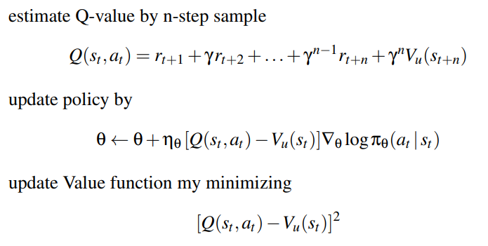
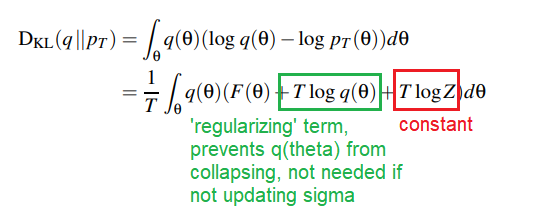

# Deep Reinforcement Learning

## Deep Q-Learning for Atari
* Learning values $Q(s,a)$ from input state s, a stack of pixels from last 4 frames
    * Output was 18 joystick/button positions
    * Reward was change in score for that timestep
* Too many states for a lookup table - instead, parametrise $Q_w(s,a)$ with weights w and minimise $[r_t + \gamma max_b Q_w(s_{t+1},b)-Q_w(S_t,a_t)]^2$
    * This isn't good as there are too many similar situations occurring one after the other - too much **temporal correlation**

## Experience Replay
* Build a database of experiences, asynchronously sample from database and minimise above function
    * Randomly choose situations = remove temporal correlations
* Other DQN Improvements:
    * **Prioritised Replay**: Store experience in a priority queue so that system concentrates effort on situations with 'surprising' Q values
    * **Double Q-Leanring**: have a current Q-network to select actions, and an older Q-network to evaluate actions (by having two sets of weights)
        * $[r_t + \gamma max_b Q_{\overline{w}}(s_{t+1},max_b Q_w(s_t+1, b))-Q_w(S_t,a_t)]^2$
    * **Advantage Function**: use action-independent value function $V_u(s)$ and an action-dependent advantage function A_w(s,a)
        * Advantage function represents advantage of taking action a at state s, compared to action preferred by the policy
        * $Q(s,a) = V_u(s)+A_w(s,a)$
        * Select actions based on max $A_w$

## Actor-Critic
* **Advantage Actor-Critic**: Use $A_w(s,a) = Q(s,a) - V_u(s)$ 
* **Asynchronous Advantage Actor Critic (A3C)**: Learn a parameterised Value function using TD-Learning 

## Evolutionary/Variational methods
* Modify mean and standard deviation of the noise
    * Have initial mean and standard deviation
    * Collect samples from Gaussian distribution, include mirrored samples
    * Evaluate fitness of each sample
    * Update the mean: $\eta \leftarrow \eta + \alpha(F(\theta) - \bar{F})(\theta - \eta)$ where $\alpha$ is the learning rate, $\bar{F}$ is the baseline fitness, $F$ the fitness

* **Evolutional Strategy**: take top 20% of samples and fit a new distribution with new $\sigma$

### Variational Inference
* KL Divergence, $D_{KL}(q\|\|p)$ is a measure of how much "evidence" each sample will on average bring when you're trying to distinguish p(x) from q(x). If p(x) and q(x) are very different, they are not good representations of each other, value is larger.
* **Variational Inference**: Aim to minimise the divergence between $q(\theta)$ and $p_T(\theta)$, where:
    * $p_T(\theta) = e^{\frac{1}{T}F(\theta)}/Z$, a Boltzmann distribution of fitness, T the temerature, Z the normalizing constant
    * $q(\theta)$ is the Gaussian distribution determined by the selected $\eta,\sigma$

