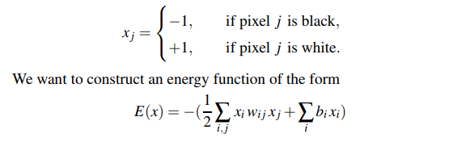
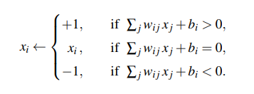
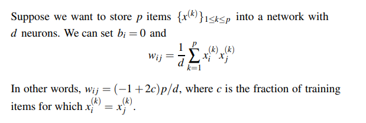
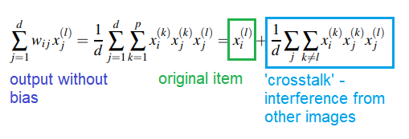
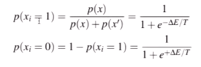
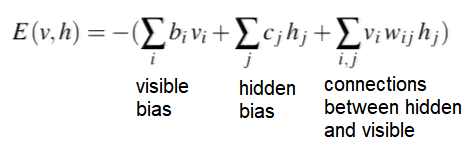
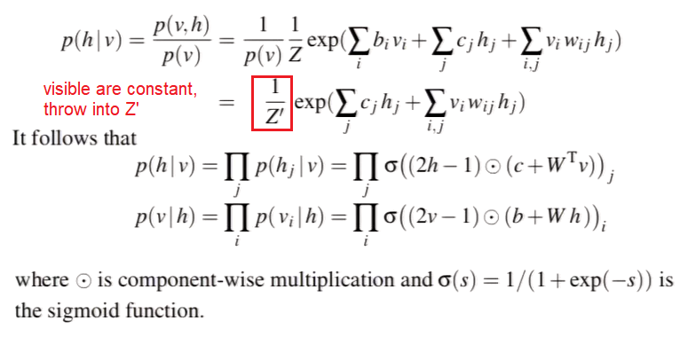

# Boltzmann Machines
* Motivation: Retrieve something from memory when presented only part of it.
    * E.g. when given a set of images that are corrupted, reconstruct the original image

## Hopfield Network
* **Energy function** is a cost function - local minima of energy function corresponds to the stored items
* For black and white images with $d$ pixels, where each image has a configuration $x = {x_j}_{1 \leq j \leq d}$ with:

* If we have p images, we have p local minima for E(x). 
* Make $w_{ij}$ be **positive if two pixels tend to have the same colour**, $w_{ij}$ is negative if they are opposite colours.
    * The 1/2 comes from assuming $w_{ij} = w_{ji}$ for all ij
    * Weights for Hopfield networks are discrete - only -1 or +1
* To generate an image, we start with an initial state x and flip $x_i$ and try and reach a lower energy state. If we factor out $x_i$ from our E(x) expression, to reduce E(x) we change it to be:

* **Hebbian learning**: update the weights according to the formula:

* For any image x:

* Reliably stored if $p/d < 0.138$, p the number of patterns and d the number of neurons in network

## Generative Models
* What if we want to generate new items, not just store and retrieve past items? **Generative model**

## Boltzmann Machine
* Differences to Hopfield
    * Energy function is the same
    * Neurons $x_i$ are between 0 and 1, not -1/+1 (break inverted colour symmetry) - think of them as features
    * Generate new states rather than retrieving stored state
    * Update is not deterministic but stochastic

$p(x) = \frac{e^{-E(x)/T}}{Z}$

* E(x) is energy function, T is temperature, Z is partition function
* Similar to softmax but you want low energy = larger probability
* **Gibbs Sampling**: Have an image x, only change one pixel at a time - if changed, find energy change. Then, we can calculate conditional probability of $x_i$ taking the value 1 or 0

* Similar to Hopfield but there is randomness to updates. 
    * Boltzmann - we could have a change that moves the image to a higher energy state
    * If repeated, eventually obtain a sample from Boltzmann distribution
    * $T\rightarrow \infty,\space p(x_i\rightarrow1)=1/2$
    * $T\rightarrow 0,\space p(x_i\rightarrow1)=0$ - behaviour becomes similar to Hopfield - energy never increases
    * Temperature T is usually fixed at 1

## Restricted Boltzmann Machine
* Original Boltzmann - everything connected to everything - every pixel connected to each other one.
* RBM - introduce hidden units in addition to the visible pixel units
    * No vis-to-vis or hidden-to-hidden connections
    * Update becomes much faster - **values for visible nodes fixed, change hidden nodes, and then vice versa**
    * Inputs are binary vectors
    * Train to maximise expected log probability of the data

* **Alternating Gibbs Sampling**: Choose v0 randomly, sample h0 from p(h\|v0), sample v1 from p(v\|h0), etc. This is called 'dreaming'

### Training RBM
* **Contrastive Divergence**: Train by comparing real and fake images, prioritise the real ones
* **Quick Contrastive Divergence**: Start with real digit, generate hidden units, generate the false (reconstructed) digit and train using those as positive and negative samples respectively
    * Not mathematically rigourous but good enough

## Deep Boltzmann Machine
* Same approach but apply iteratively to multi-layer network
* Weights from input first layer trained first, then keep those fixed and train to second layer

## Greedy Layerwise Pretraining
* Pair of layers trained as RBM, those values used as initial weights and biases for a feedforward NN, train using backprop and use for another task

https://www.doc.ic.ac.uk/~sd4215/hopfield.html