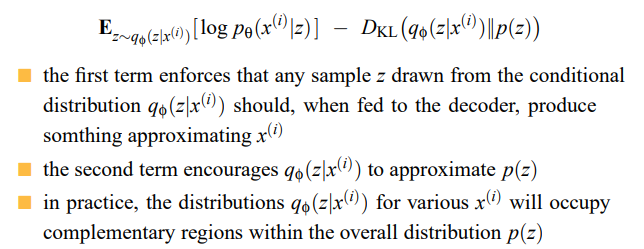

# Autoencoders
* Unsupervised pretraining: pretrain using unsupervised method to get initial weights, then refine using backpropogation (then it becomes supervised)
    * Better than backprop
* Encoder computes $z=f(x)$, decoder computes $g(f(x))$, we want to minimise the distance between z and g(f(x)):

$E = L(x, g(f(x)))$

## Autoencoder Networks
* Input to bottleneck hidden layer = encoding
* Hidden to output layer = decoding
* After autoencoder is trained, decoder part is removed and replaced with, for example, a classification layer
* **Greedy Layerwise Pretraining**: alternative to RBM - hidden layer is trained to reconstruct the input. First layer (encoder) becomes first layer of deep network

## Regularized Autoencoders
* **Trivial identity**: Often hidden nodes exceeds input nodes, might overfit (but free parameters might be less)
    * Usually don't pool as you lose information when decoding/reconstructing
    * There is a risk that autoencoder reproduces the identity function - reproduce the input exactly, we want a new image
        * Avoid by having very low number of weights/hidden nodes
        * Or, introduce some form of regularisation - penalty to force weights to be restricted

### Sparse autoencoders
* Add a penalty term based on the hidden unit activation - recall weight decay
* Instead of resizing weights, resize the hidden unit activations

$E = L(x, g(f(x))) + \lambda \sum_i|h_i|$

* This is L1 regularisation - absolute value rather than square - encourages some hidden units to go to 0, hence why it's 'sparse' - features are present or absent

### Contractive autoencoders
* Take derivative of hidden units and use L2 norm

$E = L(x, g(f(x))) + \lambda \sum_i||\triangledown_x h_i||^2$

* Forced to learn hidden features that don't change much - small change in input is mapped to a very close point in the HU space

### Denoising autoencoders 
Add noise to inputs, train to recover original input

<pre>repeat:
    sample a training item x(i)
    generate a corrupted version x˜ of x(i)
    train to reduce E = L(x(i),g(f(x˜)))
end
</pre>

## Cost Functions and Probability
* Cost function can be seen as defining a probability distribution over the outputs - we train to maximise the log of the probability of the target values
    * **squared error** assumes underlying Gaussian distribution, mean is the output of the network
    * **cross entropy** assumes Bernoulli distribution, probability is the output of the network
    * **softmax** assumes Boltzmann distribution

## Stochastic Encoders and Decoders
* Decoder is a conditional proability distribution $p_\theta(x|z) of output x$
* Encoder is a conditional proability distribution $q_\theta(z|x) of values z$
* This is what we saw in RBM

## Generative Models
* We want to make new images of bedrooms
* Explicit (Variational Autoencoders) or implicit (GANs)
    
### Variational Autoencoders
* Instead of producing a single z, we want to produce a probability distribution with mean and sd - we train system to maximise:

* First term is the probability of output being similar to the input
* Second term is the KL divergence
* Tension between both terms - KL divergence wants to stretch out the points to be the standard normal distribution, but in practice it will stretch certain dimensions out