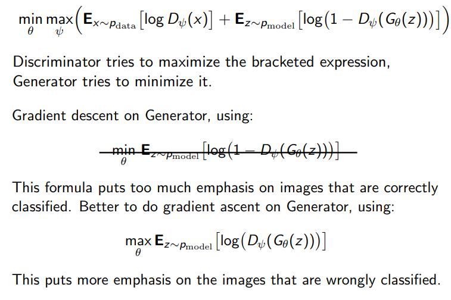
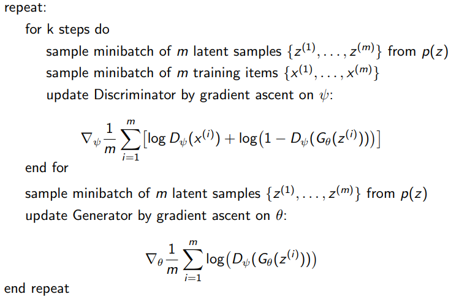

# 13 Adversarial Training and GANs

## Artist-Critic Co-Evolution
* Critic is rewarded for distinguishing real images vs generated artist images
* Artist is producing image, and is rewarded for fooling the critic into thinking it is real

## Co-Evolution Paradigms
### Blind Watchmaker
* Human user chooses best images, and after various generations gets better images
    * Artist: Genetic program 
    * Critic: Human
* PicBreeder
    * Artist: Convolutional Pattern Producing NN
    * Critic: Human

## Generative Adversarial Networks
* GANS: a **generator (artist)** and a **discriminator (critic)**, both Deep CNNs
    * Generator $z\rightarrow x$ generates imate x from latent variables z
    * Discriminator $x\rightarrow D_\psi(x)\in(0,1)$ takes in image x and estimates probability that image is real
    * Plays 2-player zero-sum game to compute:

### GAN properties and learning
* One network aims to produce full range of images x, with different values for latent variables z
* Differentials backpropgated through Discriminator and into Generator
* Images produced are much more realistic

### Architecture for NNs
* Normalise images between -1 and +1
* Don't use pooling (you lose data) - instead:
    * Discriminator: use strided convolutions
    * Generator: use fractional-strided convolutions
* Batch normalisation for both NNs
* Remove fully connected hidden layers for deeper architectures
* Use tanh for output layer of Generator, ReLU for other layers
* LeakyReLU for all Discriminator layers

### Stability
* GANs oscillate or get stuck
    * Oscillation: trains for a long time but fails to improve
    * Mode collapse: only produces a small subset of desired range of images, or collapses to single image with minor variations
* Prevent mode collapse via:
    * Conditioning Augmentation
    * Minibatch Features (Fitness Sharing)
    * Unrolled GANs
