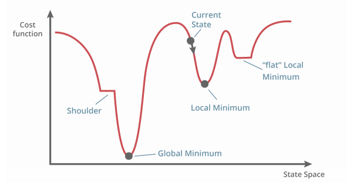

# Backpropogation
## Supervised Learning
* Three types of learning:
    * Supervised - have input and output
    * Reinforcement - have input and reward signals
    * Unsupervised - inputs only, find structure in inputs
* Supervised Learning: training set and test set with inputs and target values
    * Aim is to predict the target value
* Issues:
    * Which framework, representation
    * What training method (perceptron training, backprop)
    * Pre-processing or post-processing
    * Generalisation (avoid overfitting)
    * Evaluation (separate training and testing sets)
* Ockham's Razor: The most likely hypothesis is the simplest one consistent with the data
    * Tradeoff between fitting the data perfectlyand simplicity of hypothesis

## Two layer neural networks
Instead of one layer of links, as in Perceptrons, we have two, separated by a number of hidden units. They can be trained in a similar way to perceptron - but instead of "input to output", it goes through hidden layers ("input to hidden", "hidden to output") with the same steps.

Minimise the **error function** (also known as cost function) $E = \frac{1}{2} \sum(z-t)^2$, the squared difference between actual and desired output. This error function can be defined as an error landscape.

## Gradient Descent 
We can find a low error by taking the steepest downhill direction. We shouldn't use step function as it is discontinuous - use other activation functions.

We can then adjust the weights and take this direction:
$w\leftarrow w - \eta \frac{\delta E}{\delta w}$

Where:
$\frac{\delta E}{\delta z} = \sum(z-t)$

And:
$\frac{\delta z}{\delta s}$:
* For sigmoid: $z(s)=\sigma,\space z'(s)=z(1-z)$
* For tanh: $z(s)=tanh(s),\space z'(s)=1-z^2$

You find a local minimum (or global minimum) when the error $\frac{\delta E}{\delta z} = 0.$

## Backpropogation
1. Do a forward pass - with weights, output and calculte the error
2. Backpropogation - do partial derivatives starting from the output back to the input, and multiply all together to obtain the new weights.
    * This is efficient as you go backwards and you can reuse derivatives for other units.

## Problems with Backprop
* Overfitting: when the **training set** error continues to reduce, but **test set error starts to increase** or stall
    * Limit the number of hidden nodes or connections
    * Limit the training time
    * Weight decay - limit the growth/size of the weights - if the weights sharply increase in magnitude, NN is probably overfitting - large weights mean the output is jagged.
* Inputs/outputs should be **re-scaled** to be in the range 0 to 1 or -1 to 1
    * When doing a forward pass, **weights get multiplied by input**, so the network emphasises inputs of larger magnitude
    * Rescaling encourages inputs to be treated with equal importance
    * Missing values should be replaced with mean values
* Weights should be initialised to **very small random variables**
    * If weights are the same, they will all have the same error and model will not learn
    * Should be set to around 0 so that weights do not need to change significantly (if very positive initial weight but should be a negative weight)
    * Weights are dependent on the magnitude of the inputs (so, rescale/normalise the data)
* Training rate needs to be adjustd
    * Too low and training will be very slow
    * Too high and it may become unstable or skip minimums

## Improvements to Backprop
* **Online learning** (stochastic gradient descent)
    * In 'vanilla' gradient descent, we have $w\leftarrow w - \eta \frac{\delta E}{\delta w}$. $\delta E$ still has the sum of differences for all samples ($\frac{\delta E}{\delta z} = \sum(z-t)$). That is a lot of samples.
    * Instead, we use the error of the latest training sample - 
$\frac{\delta E}{\delta z} = (z-t)$. Using the cost gradient of one sample instead of the sum of all.
    * Weights are updated after each training item using differentials generated by that item - not the cost and gradient over the full training set.
* **Batch learning**
    * Instead of using one sample (or all samples), aggregate many samples into 'minibatches' and update weights only after that batch is collected.

## Applications of 2 Layer NNs
* Medical diagnosis
    * Attributes: glucose concentration, blood pressure, skin fold thickness
* Autonomous driving, game playing
    * ALVINN: Autonomous Land Vehicle In a Neural Network, with camera and later with sonar range finder
        * Sonar with 8 x 32 input, 29 hidden units, 45 output
* Handwriting recognition
* Financial prediction

## Resources 
* [http://colah.github.io/posts/2015-08-Backprop/](http://colah.github.io/posts/2015-08-Backprop/) - The maths and reason behind backpropogation
* [https://towardsdatascience.com/difference-between-batch-gradient-descent-and-stochastic-gradient-descent-1187f1291aa1+](https://webcache.googleusercontent.com/search?q=cache:6uU5c-WPZJIJ:https://towardsdatascience.com/difference-between-batch-gradient-descent-and-stochastic-gradient-descent-1187f1291aa1+&cd=1&hl=en&ct=clnk&gl=au )- How stochastic gradient descent works