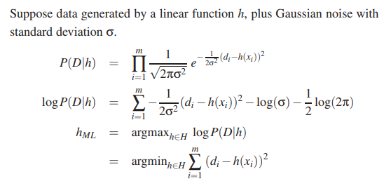
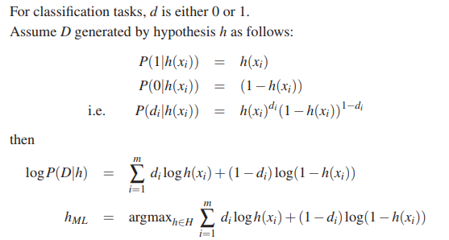

# Variations on Backprop
## Cross entropy

Problem: Least squares error function is unsuitable for classification, where target $t = 0\space or\space 1$

$E = \frac{1}{2}(z-t)^2$

Solution: Use a cross entropy error function (using maximum likelihood)

$E = -tln(z)-(1-t)ln(1-z)$

where t is 0 or 1. (Consider when actual z is close to t, E tends to 0)

## Probability and Maximum Likelihood 
* Gaussian Distribution: normal distribution where the sum of all values is equal to 1.
    * $P(x)=\frac{1}{\sqrt{2 \pi} \sigma} e^{-\frac{1}{2\sigma^2}(x-\mu)^2}$

* **Maximum Likelihood** states that you should choose a hypothesis $h \in H$ such that it maximises the likelihood that the data D is generated under that hypothesis, e.g. $h_ML = argmax_{h\in H}P(D\|h)$

For least squares:

For cross entropy:

* Bayes rule: probability of A given B: $P(A\|B) = \frac{P(B\|A)P(A)}{P(B)}$
* In machine learning:
    * $P(D\|h)$ = the probability of data D being generated under hypothesis h in all hypotheses
    * $P(h\|D)$ = the probability of hypothesis h is correct, given the data D was observed
    * $P(h)$ is called the prior

## Weight decay
* Small weights are more likely to occur than large weights
* So, penalise larger weights - increase error if large weight

$E = \frac{1}{2} \sum_i(z_i-t_i)^2 + \frac{\lambda}{2} \sum_j w_j^2$

* Therefore we reduce ('decay') the weight when we update them:

$w\leftarrow w - \eta \frac{\delta E}{\delta w} - \eta \lambda w$

* [https://stats.stackexchange.com/questions/29130/difference-between-neural-net-weight-decay-and-learning-rate](https://stats.stackexchange.com/questions/29130/difference-between-neural-net-weight-decay-and-learning-rate)

## Momentum
* Weights tend to oscillate without much improvement. Add a momentum factor before calculating the actual weights.

$\delta w\leftarrow \alpha \delta w + (1-\alpha)\frac{\delta E}{\delta w}$

$w\leftarrow w - \eta \delta w$

* This dampens sideways oscillations (gradient multiplied by $1-\alpha$), and amplifies downward motion by $\frac{1}{1-\alpha}$

## Other Variations
* Conjugate gradients: compute secondary derivatives $\frac{\delta^2 E}{\delta w_i \delta w_j}$, approximate landscape with quadratic function and jump to minimum of quadratic function
* Natural gradients