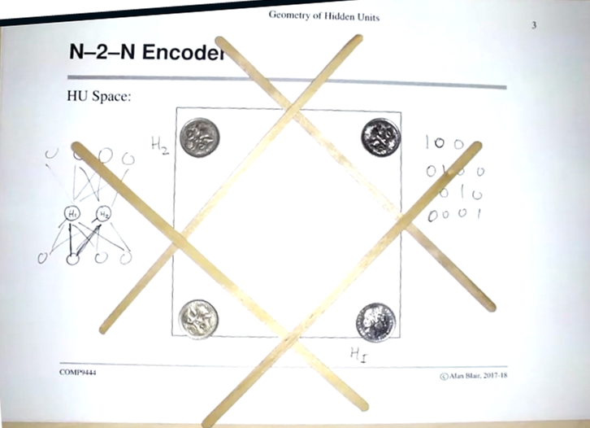

# Geometry
## Encoder Networks
* Visualising hidden unit dynamics
* N-M-N task - e.g. 5-3-5 meaning 5 inputs, 5 outputs, squashing/bottleneck data into 3 hidden units

For N-2-N:

* This represents a 4-2-4 encoder.
    * There are 4 possible inputs that are the same as the outputs, represented by points. This is the table on the right.
    * There are two hidden units, which can be represented by lines (a function of H1, H2 and a bias). 
    * The aim is for the hidden units to split the points ('squash' into two hidden units)
    * When there are too many inputs, the network becomes too constrained and unstable
* During training, the points start around the middle and move to the corners as it improves
* Similar to autoencoders that compress images, later in the course.
* If there are 3 hidden units, hidden units are not lines but planes, coins go to a corner of a square (e.g. for 8-3-8 it is coins on a cube octahedron)

## Hinton Diagrams
* White is positive, black is negative, larger the point, the more positive/negative
* Looks at one hidden unit
* Superposition of inputs

## Symmetries
* Swapping hidden nodes will have the same overall function
* Changing weights to be negative by reversing sign of weights
* If weights are the same for two hidden units, they will have the same errors and weight updates, which is why you should randomise your weights at the start
    * Hidden units should try to do a similar job first but then specialise
    * Each layer implements an approximately linear function, two layers introduces a bit of non-linearity. Should try not to be too non-linear

## Limitations 2 Layer NN
* [Twin Spirals](http://colah.github.io/posts/2014-03-NN-Manifolds-Topology/)
    * First layer is the line for positive/negative
    * Second layer learns convex features
    * Third layer can learn concave features, like holes
    * Hard to do - very low learning rate and initial weight values, otherwise network converges to local optimum
* [https://www.cs.cmu.edu/~dst/pubs/byte-hiddenlayer-1989.pdf](https://www.cs.cmu.edu/~dst/pubs/byte-hiddenlayer-1989.pdf)

## Vanishing and Exploding Gradients
* When weights are too small, differentials become smaller as you backpropogate through the layers
* When weights are too large, activations in higher layers saturate to extreme values - gradients also become very small
* Weights with intermediate values - differentials sometimes gets multiplied many times where the transfer function is steep - blow up
* Solved by:
    * Layerwise unsupervised training
        * Train and get useful features first before caring about the output
    * LSTM for recurrent neural networks
    * New activation functions

## Dropout
