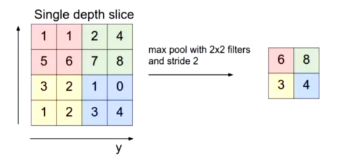

# Convolutional Networks
## Layers
* **Convolution layers**: extract shift-invariant features from the previous layer
* **Subsampling/pooling layers**: Combine activations of multiple units from previous layer into one unit
* **Fully connected layers**: Collect spatially diffuse information
* **Output layer**: Choose between classes

## Softmax
Softmax extends the sigmoid function and allows you to classify $N$ classes, $z_j$ is the output corresponding to class $j$. 
* Estimate is proportional to exponential
* All probabilities add to 1
* Normalise by dividing by sum

$P(i) = \frac{e(z_i)}{\sum_{j=1}^N e(z_j)}$

$log P(i) = z_i - log \sum_j exp(z_j)$

* First term pushes up the correct class $i$
* Second term pushes down the incorrect class $j$ with the highest activation

## Convolutional

* 9 weights, the same weights are applied to each $M \times N$ block.
* Shift the green box (filter) along - because of the size of the filter, this will reduce the width and height of the next layer - becomes 5 by 4.
* If J=K=32, M=N=5, 3 input channels, 6 filters (different weights, detects different lines/features) in this layer:
    * **Width of next layer**: 32 + 1 - 5 = 28
    * **Weights per neuron**: 1 + 5 * 5 * 3 = 76
        * includes bias, 5 * 5 weights, 3 input channels
    * **Neurons**: 28 * 28 * 6 = 4704
        * Number in the hidden layer
    * **Connections**: weights * weights * neurons = 357,504
    * **Independent parameters**: 6 * 76 = 456
        * weights of each filter are independent
* Zero padding: treat off-edge inputs as zero, so it will be the same size of original image
* Stride dimensions: skipping some values (instead of 0, 1, 2... do 0, s, 2s...)

## The other layers
* Max pooling:
    * Get maximum value for pool of 4
    * Stride is the number of neurons jumped

* Overlapping pooling: when width is larger than stride

* Fully connected: layers connected and then passed through layers into output units

