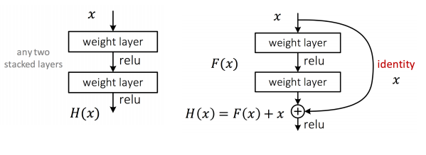
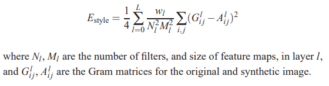
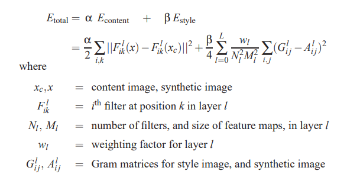

# Image Processing
## Image Datasets and Tasks
* Various datasets: 
    * MNIST handwritten digits, 10 classes, 6000 each
    * CIFAR colour images, 10 classes, 5000 each
    * ImageNet LSVRC - more images
* Tasks:
    * image captioning
    * image classification
    * object detection
    * object segmentation
    * generating images
    * generating art
    * style transfer

## AlexNet
* Enhanced using: ReLUs, overlapping pooling, stochastic gradient descent with momentum and weight decay, 50% dropout in fully connected layers
* **Data augmentation**
    * Cropping out 10 patches of the original image
    * Horizontal reflection of each patch included
    * RGB channels had changed intensities
    * Predictions of the 10 patches averaged at testing
* Convolution Kernels
    * Filters on GPU-1 are colour agnostic
    * Filters on GPU-2 are colour specific

## Deep Networks
* \> 10 layers: weight initialisation and batch normalization
* \> 30 layers: skip connections
* \> 100 layers: identity skip connections

### Weight Initialization
* We want changes in the weights between layers to be around the same size.
    * This is affected by the variance in input and output, number of outputs ($n_i^out$) and a constant that takes into account the transfer function ($G_0$)
* We know that for D layers, the variance is:

$Var[\frac{\delta}{\delta x}] = (\prod_{i=1}^D G_0 \times n_i^out\times Var[w^{(i)}])\times Var[\frac{\delta}{\delta z}]$

* We want the variance to be around the same between input and output (left and right) - so therefore we choose weights such that

$(\prod_{i=1}^D G_0 \times n_i^out\times Var[w^{(i)}]) = 1$

### Batch Normalization
* We want to normalise the activations of the nodes of a particular layer. To do that, we normalise the activations $x_k^{(i)}$:

$\hat{x}_k^{(i)} = \frac{x_k^{(i)} - Mean[x_k^{(i)}]}{\sqrt{Var[x_k^{(i)}]}}$

* Then we shift and rescale it with our own custom mean and variance, that can be trained as well using backprop with the other parameters/weights.

$y_k^{(i)} = \beta_k^{(i)} + \gamma_k^{(i)}\times \hat{x}_k^{(i)}$

## Residual Networks
* Skip a layer, add a skip connection and add to the output

* F(x) is called a residual component
    * Corrects errors from previous layers, or provides additional details
* So instead of using H(x) as our output, we refine x with the residual F(x)

## Dense Networks
* In a densely connected block, each layer is connected by shortcut connections to all preceding layers
* Each block is separeted by convolution and pooling

## Texture Synthesis
1. Pretrain CNN
    * Hidden layers generated that are general purpose
2. Pass input texture through CNN, compute feature map $F_{ik}^l$ for the $i^{th}$ filter at spatial location k in layer l
3. Compute Gram matrix for each pair of features $G_{ij}^l = \sum_k F_{ik}^l \times F_{jk}^l$
4. Feed random image into CNN, compute L2 distance between original and new image
5. Backprop to get gradient on image pixels, update image and go to step 4

## Neural Style Transfer
* Take content of image and style of another and combine to produce a new image

