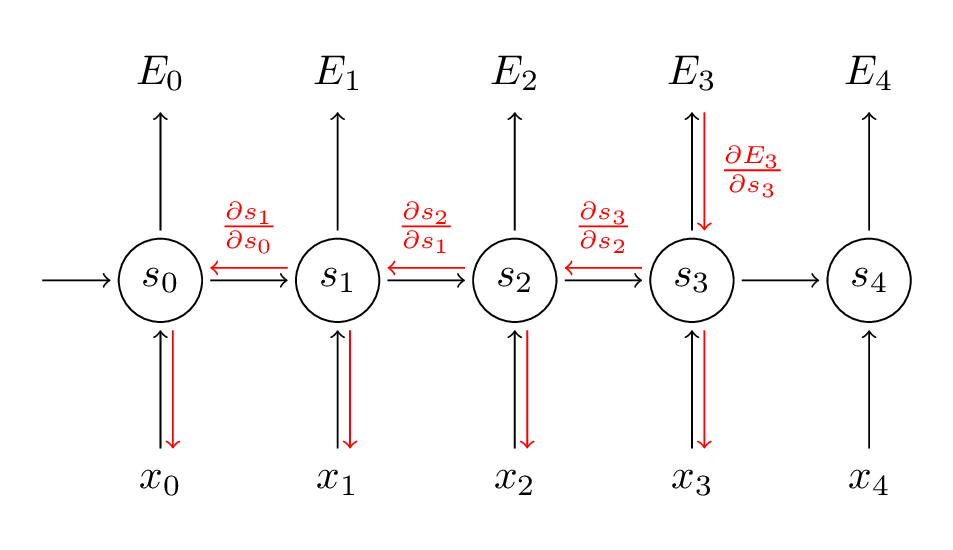

# Recurrent Networks
## Usage
* Used to predict a sequence of inputs
    * Speech recognition
    * Time series prediction
    * Machine translation
    * Handwriting recognition

## NetTalk
* Sliding window - window of 7 characters (input), predict the pronunciation of the middle input
* 26 output units representing the alphabet
* Can only learn short term dependencies

## Simple recurrent network
* Simple recurrent network
    * At each time step, hidden layer activations copied to a 'context' layer
    * Hidden layer receives connections from input and context layers
    * Context layer retains state information for indefinite period of time
* Backpropogation is done through time - recurrent 

* Second order network - have two (or more) sets of weights and switch between them
    * Also called gated - could have a weight of 0 and weight of 1

## Finite State Machine

As they are trained, the points/areas move apart.

Chomsky Hierarchy:

| Language | Machine | Example |
|----------|---------|---------|
| Regular | Finite State Automation | $a^n\space (n\space odd)$ |
| Context Free | Push Down Automation | $a^n b^n$ |
| Context Sensitive | Linear Bounded Automation | $a^nb^nc^n$|
|Recursively Enumerable | Turing Machine | true QBF

* Formal Language Prediction: predict next character/word in the sequence. 
    * Elman Network
    * Predict next after abaabbaaabbb...
    * Line to separate classes

## Long Range Dependencies
* Long Short Term Memory (LSTM)
    * [colah's blog](http://colah.github.io/posts/2015-08-Understanding-LSTMs/)
* Gated Recurrent Units (GRU)