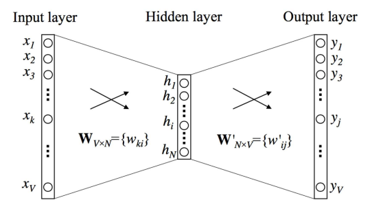
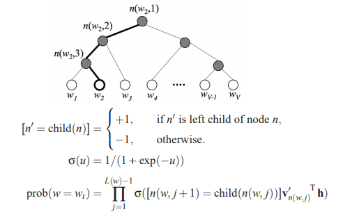
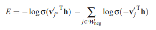
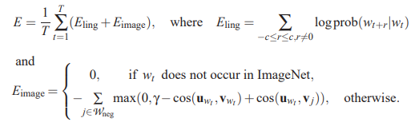

# Language Processing
## Models
* 1-Gram: 1 preceding word, 2-Gram: 2 preceding words
    * Rows and columns of words (left then top)
    * Normalise each row to sum to 1 (divide by total occurrences) to estimate the probability of a word occurring after another word
* Co-occurrence Matrix
    * Each row is a word, each column represents a nearby word
    * 10-word window is 5 words on either side

## Singular Value Decomposition
* The co-occurrence natrix can be decomposed as $X = USV^T$.
    * $U_{(L\times L)}$, are unitary (all columns have unit length)
    * $V_{(M\times M)}$, are unitary
    * $S_{(L\times M)}$ is diagonal with entries $s_1 >= s_2 >= ... >= s_M >= 0$

* Usually L=M=number of words in vocabulary, or M is the number of documents in the collection
* This is expensive, so we use:
    * word2vec: 
        * predictive model
        * maximises the probability of a word based on surrounding words
    * GloVe:
        * count based model
        * reconstruct a close approximation to the co-occurrence matrix X

## word2vec

* Say you have a dictionary of V words - each word can be represented in 'one hot encoding', e.g. a vector of 0's with a 1 at a particular location.
    * 10000000 could be the word 'apple' in dictionary of 8 words
* Input is a one-hot encoded word
* Output, when softmax is applied, is a vector of probabilities
    * Each probability represents the chance the word appears nearby the input (context) word
* Hidden units act as an $V\times N$ lookup table - given a V, it will return weights for that V. This is because the input is one-hot encoded.
    * Those weights/features are then used with softmax to predict nearby words

### Cost function
* Probability that the word j is occurring in the context of the word k:

$prob(word_j\|word_k) = \frac{exp(u_j)}{\sum_{j'=1}^V\space exp(u_{j'})}=\frac{exp({v'}_j^Tv_k)}{\sum_{j'=1}^V\space exp({v'}_{j'}^Tv_k)}$

* Cost is the log of this. We want to maximise:

$1/T\sum_{t=1}^T\sum_{c}log prob(w_{t+r}\|w_t)$

### Extensions for word2vec
* Continuous Bag of Words
    * Have multiple inputs (words) that return one possible nearby word
    * All inputs have the same weights $W_{V\times N}$
* Skip-Gram Model
    * Have multple nearby outputs (words) from the one input
    * All outputs have the same weights $W'_{N\times V}$

### Efficiency of word2vec
* **Hierarchical Softmax**
    * Instead of calculating softmax for all words, have the output correspond to a branch of a tree
    * Only nodes visited along the path to target word are evaluated ($log_2(V)$ nodes)
    * Each path is a sigmoid function, each path represents a probability and you multiply the probabilities
    * Frequency of words on left children are about the same as frequency of right children (Huffman property)

* **Subsampling**
    * Diminish the influence of more frequent word
    * Discard words with a probability based on the frequency of the word. $t ~ 10^-5$

$P(w_i) = 1-\sqrt{\frac{t}{f(w_i)}}$

* **Negative Sampling**
    * Update only a small number of weights, rather than all of them, for the word pair
    * Choose a small number of 'negative' words (words that we want the network to output 0 for) and update those weights
        * Around 5-20 for small datasets, 2-5 for large
    * Also update the 'positive' word
    * Error:

    
* use unigram distribution for the selection of negative samples. This is its weight equal to frequency raised to 3/4 power.

$P(w_i) = \frac{frequency(w_i)^{3/4}}{\sum_{j=0}^nfrequency(w_j)^{3/4}}$

Which is equivalent to:

P(w) = U(w)3/4/Z

U(w) = Unigram distribution determined by previous word,
Z = normalizing constant.

* http://mccormickml.com/2016/04/19/word2vec-tutorial-the-skip-gram-model/

## Multi-modal Skip-Gram
* Augment skip-gram model to label features from images with words
    * Extract activations $u_j$ for each word from highest layers of a CNN model

## Applications for Translation
* **Neural translation**
    * Convert from English to French
    * Last LSTM hidden unit encodes entire English sentence
    * Decoded into French in reverse
* **Bidirectional Recurrent Encoder**
    * Words from later tells you current meaning - one LSTM going forward direction, the other going in the reverse direction
* **Attention Mechanism**
    * Instead of only taking the last hidden unit, take the weighted sum of all hidden units in the RNN/LSTM. Weights chosen by backpropogation
    * Focuses attention on those timesteps which are most relevant for choosing the next word in the translated sentence.
    * Focuses attention on part of the sentence we are translating via the weights
* **Google Neural Machine Translation**
    * Stacked LSTMs, with each feeding in to more layers
    * Skip connections
* **Captioning with Attention**
    * Image (CNN weights) replaces the sentence input