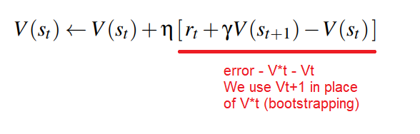
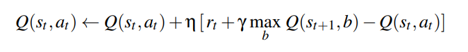
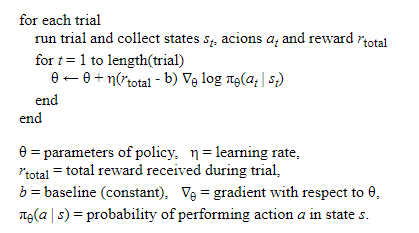
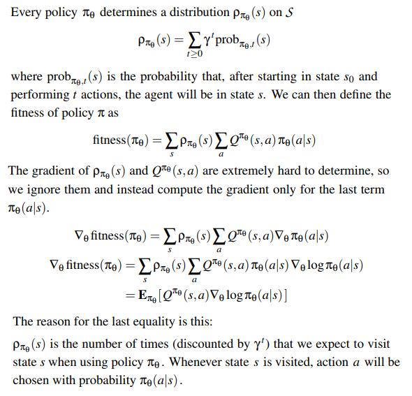
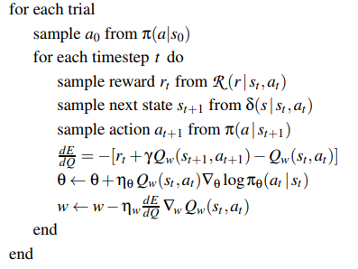

# Reinforcement Learning
* Use reinforcement learning is when it is hard to provide a training set
    * E.g. situation-action pairs

## Framework
* An agent interacts with its environment.
* There is a set $S$ of states, set $A$ of actions
* At each time t, agent is at a state $s_t$, must choose an action $a_t$
    * Goes into state $s_{t+1}=\delta(s_t,a_t)$
    * Receives a reward $r_t = R(s_t,a_t)$
* Agent has a policy $\pi:S\rightarrow A$, and the aim is to find an optimal policy $\pi^*$ that maximises the cumulative reward
* $\delta, R, \pi$ can be multi-valued with random element (e.g. can be treated as probability distributions)

## Models of Optimality

| Reward                     | Cumulative reward                                             | Comment                                                                 |
|----------------------------|---------------------------------------------------------------|-------------------------------------------------------------------------|
| Finite horizon reward      | $\sum_{i=0}^{h-1} r_{t+i}$                                    | Simple computationally                                                  |
| Infinite discounted reward | $\sum_{i=0}^\infty\gamma^ir_{t+i}$                            | Easier for proving theorems                                             |
| Average reward             | $lim_{h\rightarrow \infty}\frac{1}{h}\sum_{i=0}^{h-1}r_{t+i}$ | Cannot sensibly choose between small reward soon and large reward later |

* Various ways of learning, based on:
    * Value Function Learning, e.g. TD-, Q-Learning
    * Policy Learning, e.g. Hill Climbing, Policy Gradients
    * Actor-Critic, a mix of both

## Value Function Learning
Each policy $\pi$ has a **value function** $V^\pi:S\rightarrow R$ where $V^\pi(s)$ is the **average discounted reward** received by agent who starts at s and chooses actions according to $\pi$

Average discounted reward - rewards arriving later in the future are worth less - controls how far the agent looks ahead when making predictions.

The agent retains its own estimate of $V^\*$, the maximum (expected) discounted reward. The aim is to start with a random V and improve it until it is close to V\* (bootstrapping).

### Exploration vs. Exploitation
* Either choose a random action or choose what we think is the best action
    * choose a random action 5% of the time, or
    * use **Softmax (Boltzmann distribution)** to choose next action:

$P(a) = \frac{e^{R(a)/T}}{\sum_{b\in A}e^{R(b)/T}}$

### TD-Learning
* For the true value $V^\*(s)$, it is equal to the immediate reward plus discounted value of the next state:

$V^\*(s)=R(s,a)+\gamma V^\*(\delta(s,a))$

* For the estimated value, we want to learn - so incorporate the error and learning rate:

### Q-Learning
* Q-Learning is similar but depends on a state-action pair, not just a state. Done via the function $Q^\pi : S \times A \rightarrow R$ in place of the value function.

* Limitations:
    * **Delayed reinforcement**: rewards might not be received until several time steps after - slows down learning
    * Search space must be finite - relies on visiting every state infinitely often
    * Real world problems cannot rely on lookup table (we are looking up the reward for a particular state or state-action) - need to generalise

### Backprop
* Supervised learning:
    * Learn from human games
* TD-Learning
    * Use subsequent positions to refine evaluation of current position
    * General method that does not rely on world model, e.g. the rules of the game

* [TD Learning and backprop ](https://web.stanford.edu/group/pdplab/pdphandbook/handbookch10.html)

## Policy Learning
* Attempt to optimise the policy $\pi_\theta : S\rightarrow A$ directly, with parameters $\theta$
    * We consider the **fitness of a policy** as the value function of initial state under that policy

$fitness(\pi_\theta) = V^{\pi_\theta}(s_0)=E_{\pi_\theta}(r_{total})$

### Evolution Strategy
* **Hill climbing**
    1. Initialise a 'champ' policy $\theta_{champ} = 0$
    2. For each trial, generate a mutant policy $\theta_{mutant} = \theta_{champ} + Gaussian\space noise$
    3. Evaluate both on same task, if mutant is better then $\theta_{champ}\leftarrow (1-\alpha)\theta_{champ} + \alpha\theta_{mutant}$
### Policy Gradients
* Use **gradient ascent** instead of random updates. For episodic:
    * After a sequence of actions, we receive a total reward - distribute reward to each action equally
    * If total reward is high, we change parameters to make agent more likely to take those actions in similar situations, e.g. we want to increase the total reward: $log\prod_{t=1}^m \pi_\theta (a_t\|s_t)$
    * This is the REINFORCE algorithm:

* For non-episodic, rewards are received incrementally throughout the game - policy is a probability distribution

## Actor-Critic
* For the above fitness gradient, it is hard to estimate the Q value. **Actor-Critic**:
* Critic NN measures how good the action taken is (value-based)
    * Have a family of Q functions and learn different parameters to approximate $Q^{\pi_\theta}$
* Actor NN controls how our agent behaves (policy-based)
    * At the same time as approximating $Q^{\pi_\theta}$, we are learning the best policy
* Instead of updating eery episode in REINFORCE, we update every step (e.g. like in TD Learning)

